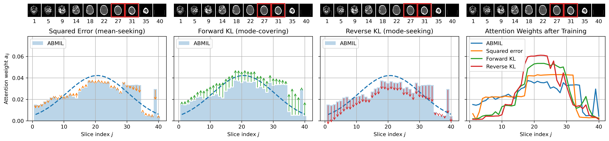

# normal-guidance

Normal Guidance is what Attention Needs by Anonymous

Figure 1: Normal Guidance on one 3D CT scan under different divergences $D$. *Left panels*: using squared error (orange), forward KL (green), and reverse KL (red). Arrows indicate direction of change for each attention weight $a_{ij}$ to reduce $D(\cdot)$ via a gradient step; line length indicates magnitude of the regularization term for each attention weight. *Right*: Attention weights $a_{i}$ after training with standard ABMIL or with Normal Guidance. Normal Guidance improves the distribution's unimodality and focus, though recovering the true ROI (red region in top bar) remains imperfect.

For Normal Guidance implementation see `losses.py`. For Max, Mean, ABMIL, TransMIL, SmAP, and SmTP implementation see `layers.py`. For training implementation see `frozen_MIL.py`.
